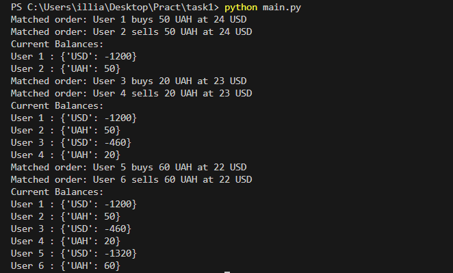
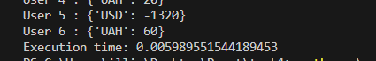

# Task #1. OrderBook

На цю задачу орієнтовно витрачено 2 годин. Більше часу буле витрачено на вивченя, що це і як його грамотно реалізувати. Код має швидкість O(n), де n - кількість ордеров

Код є досить оптимізованим. Підхід, використовуваний зіставлення ордерів, дозволяє уникати надлишкових циклів. Цикл while у match_orders завершується, як тільки не залишається можливих угод. Використання лямбда-функції для сортування ордерів за ціною дозволяє компактніше записати логіку сортування.


## Запуск

```bash
python3 main.py
```

## Результат



## Примітки

На початку код мав таку швидкість


Після оптимізації, код набув таку швидкість



Було прибрано зайві цикли, зайві умови

P.s: була думка про використання паралельних процесів, але не було ясності у доцільності цього підходу. Якщо мається на увазі невеликий обсяг даних, то використання паралельних процесів не є обов'язковим, оскільки код працює швидко й без них. Але якщо маємо справу з великим обсягом даних, використання паралельних процесів стає баженим.