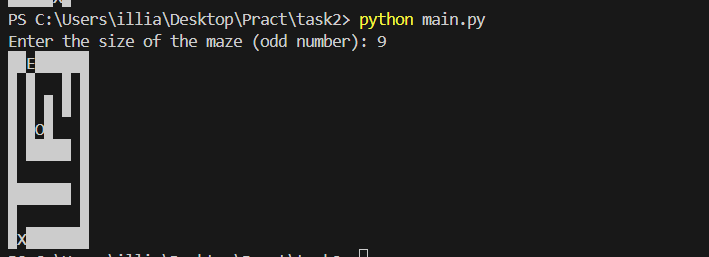

# Task #2. Maze

На цю задачу орієнтовно витрачено 8 годин. 

По своєї суті, це є [цей алгоритм](https://en.wikipedia.org/wiki/Maze_generation_algorithm) (Recursive Backtracking), але більш спрощиний та, як на мене, біль оптимізований. 

Також було покращено алгоритм додавши _CellType_, таким чином можна швидко додавати чи видаляти тип комірки. Швидкість O(n^2), де n - розмір матриці.

Алгоритм:

1. Оберемо початкову точку на полі.
2. Випадковим чином оберемо стіну у цій точці та проріжемо прохід до сусідньої клітинки, за умови, що сусідня клітина ще не була відвідана. Ця дія робить обрану клітинку поточною.
3. Якщо всі сусідні клітинки вже відвідані, повернемось до останньої клітинки з невирізаними стінами і повторимо процес.
4. Алгоритм завершується, коли процес повертається до початкової точки.


_Примітка:_
В алгоритмі Recursive Backtracker використовується прохід по сусідніх клітинах. Якщо розмір лабіринту парний, то центральна клітина матиме координати *(size/2, size/2)*, які є цілими числами для лабіринтів з парним розміром. Тому, щоб гарантувати симетричну структуру лабіринту та правильне розміщення входу, виходу та скарбу, зручно вибирати непарні розміри.

## Запуск

```bash
python3 main.py
```

## Результат

