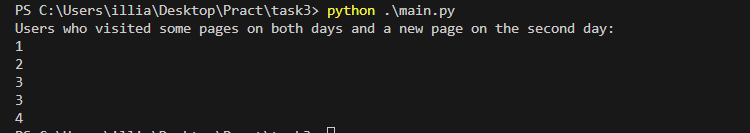

# Task #3. Website analytics

На цю задачу орієнтовно витрачено 3.5 години, бо на початку код був жутко не оптимізований. На оптимізацію було витрачено близько 2 годин. Швидкість  O(n + m * p)

Де:
n - кількість записів у таблизі 
m - кількісь відвідуючик у перишй день
p - кількісь відвідуючик у другий день


Я вважаю, що цей код є оптимізованим, бо під час вирішення збіг замовленням нема потреби створювати копії списків замовлень. Замість цього, код працює безпосередньо з існуючими замовленнями, змінюючи їх стан. Це економить оперативну пам'ять.


## Запуск
```bash
python3 main.py
```

## Результат

