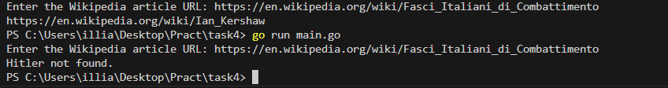
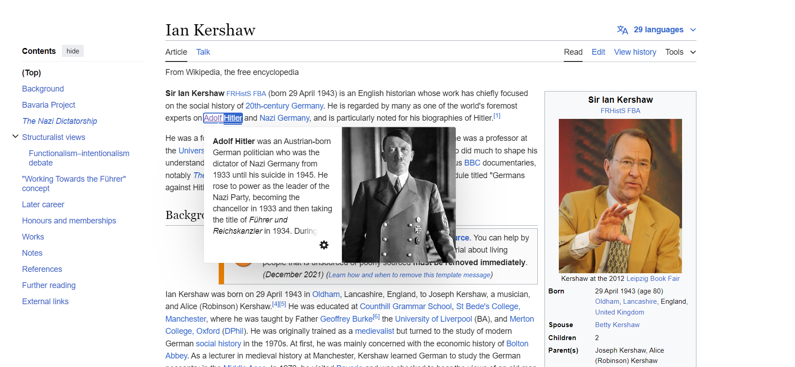

# Task #4. Hitler crawler

На цю задачу орієнтовно витрачено 2.5 години. Опитимізував код завдяки кешуванню  відповідей, щоб уникнути повторного вилучення посилань з тих самих сторінок. Перед початком програма перевіряє, чи є у кеші наявність кешованих результатів для даного URL перед тим, як отримувати посилання з сервера

## Запуск

```bash
go run main.go
```


## Результат



Знайдено на 

