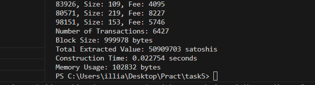

# Task 5. Backpack with Bitcoin transactions

На цю задачу орієнтовно витрачена година. Алгоритм спочатку сортує транзакції за їхнім відношенням оплати до розміру (відсоток оплати на байт). Це дозволяє вибирати транзакції з найбільшою оплатою на байт, що максимізує загальну оплату у блоку. Алгоритм має швидкість O(n log n), де n - кількість транзакцій. 

Спочатку зчитуємо транзакції O(n), потім сорторуємо, поки не дойдемо до ліміту O(n log n), 


## Запуск

1. Якщо треба згенерувати транзакції (опціанально)

```bash
python3 generator_transaction.py 
```

2. Запуск програми

```bash
go run main.go
```

## Результат



