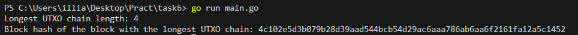

# Task #6.  The Longest UTXO chain

На вирішення цієї задачі пішло близько 5 днів. Основною проблемою було відсутність електроенергії. Це ускладнювало пошук інформації та синхронізацію з блокчейном. Якби була електроенергія, я, напевно, впорався б із завданням швидше.

Я використовував бібліотеки btcsuite вдруге в житті, тому для мене було цікаво дізнатися про них. Також дізнався, як працювати з RPC та Bitcoin Core.


## Запуск
1. Потрібно скачати bitcoin core [лінк](https://bitcoin.org/en/bitcoin-core/)
2. Відкрити доступ до ноди (це на базі rpctest, можливо і на інші мережі, але я не перевіряв, бо банально не вистачає швидкості для конекту)

```bash
bitcoind -regtest -rpcuser=NAME -rpcpassword=PASSWORD -fallbackfee=FEE
```
3. Заванатижити гаманец, з якого будемо дивитись найбільше довге UTxO

```bash
bitcoin-cli -regtest -rpcuser=USER -rpcpassword=PASSWORD loadwallet NAME_WALLET 
```

3. Занести у .env данні, а саме логін, пароль та порт, на якому працює rpc

```text
RPC_USER=NAME
RPC_PASS=PASSWORD
RPC_HOST=localhost:18443 (тільки для прикладу)
```

4. Підвантажити подрібні ліби

```bash
go get github.com/btcsuite/btcd@v0.24.0
go get github.com/btcsuite/btcd/btcutil@v1.1.5
go get github.com/btcsuite/btcd/chaincfg/chainhash@v1.1.0
go get github.com/btcsuite/btcd/btcec/v2@v2.3.3
go get github.com/btcsuite/btclog@v0.0.0-20170628155309-84c8d2346e9f
go get github.com/btcsuite/go-socks@v0.0.0-20170105172521-4720035b7bfd
go get github.com/btcsuite/websocket@v0.0.0-20150119174127-31079b680792
go get github.com/decred/dcrd/crypto/blake256@v1.0.1
go get github.com/decred/dcrd/dcrec/secp256k1/v4@v4.3.0
go get github.com/joho/godotenv@v1.5.1
go get golang.org/x/crypto@v0.22.0
go get golang.org/x/sys@v0.19.0
```

5. Запустити проект 

```bash
go run main.go
```

## Результат

