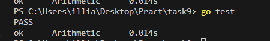

# Task #9.  Long Arithmetic

На цю задачу орієнтовно витрачено 4 години (на прості дії (додавання, множення і тд.)). На бонусне було витрачено не більш ніж 8 годин , бо цю теми вивчав з 0-ля (Karatsuba multiplication), на друге бонусне просто не вистачило швидкості інтернету. З першим так довго через цю ж проблему. Банально було складно завантажувати контент з сайтів 

## Запуск

```bash
go test
```

## Результат

